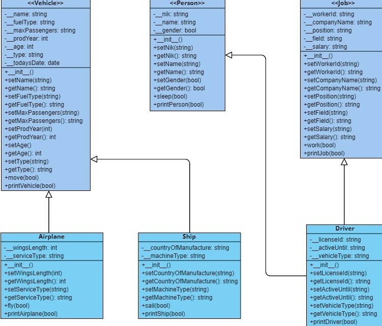
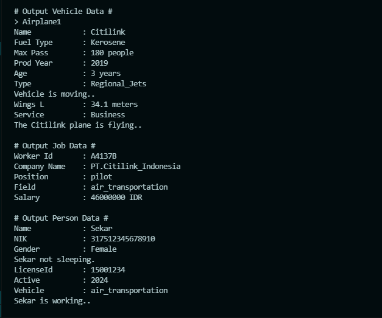

# LATIHAN4DPBO2022
> Sekar Madu Kusumawardani
> 2007703
> Ilmu Komputer - C1
> Universitas Pendidikan Indonesia

Repositori ini dibuat sebagai dokumentasi pengerjaan latihan praktikum 4 dalam mata kuliah Desain dan Pemrograman Berorientasi Objek pada program studi Ilmu Komputer Universitas Pendidikan Indonesia.

## Multiple Hierarchical Inheritance
```
Saya Sekar Madu Kusumawardani_2007703 mengerjakan Latihan Praktikum 4 dalam mata kuliah Desain dan Pemrograman Berorientasi Objek
untuk keberkahanNya maka saya tidak melakukan kecurangan seperti yang telah dispesifikasikan. Aamiin.
```
### Material
[Modul-4_Multiple-Hierarchical-Inheritance.pdf](/Modul-4_Multiple-Hierarchical-Inheritance.pdf)

### Class Diagram


* Kelas Vehicle menjadi parent untuk kelas Ship dan Airplane
* Kelas Person dan Job menjadi parent untuk kelas Driver

### Program Result
input data : [input.txt](/input.txt)


